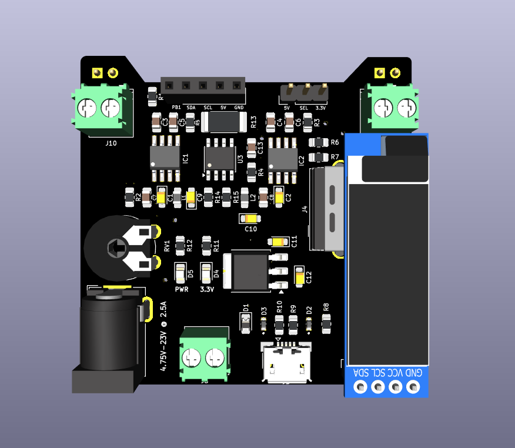

# Over-Engineered Breadboard Power Supply

A compact, **over-engineered breadboard power supply** designed for safe, flexible, and monitored power delivery during electronics prototyping and embedded system development.
This project emphasizes **good PCB practices**, **power integrity**, and **educational clarity**.

---

## 🔧 Project Overview

This power supply accepts a **wide input range (4.5–20 V)** and provides **three regulated output rails**, each capable of delivering up to **2.5 A**, making it suitable for demanding prototyping setups.

Key goals of this design:

* Stable power delivery
* Accurate current and voltage monitoring
* Hand-solderable PCB
* Clear separation of power and signal domains

---

## Front View




## ⚡ Key Features

* **Input options**: DC barrel jack, terminal block, and USB (logic power)
* **Output rails**:

  * Adjustable **4–20 V** (2.5 A)
  * Fixed **5 V** (2.5 A)
  * Fixed **3.3 V** (2.5 A)
* **Dual buck converters** (fixed + adjustable)
* **Low-noise LDO** for logic supply
* **INA219** current & voltage monitor with **10 mΩ shunt**
* Proper **Kelvin routing** for accurate measurements
* **ATtiny85** for system control and monitoring
* **I²C OLED display** for live voltage and current readout
* Breadboard-compatible headers and terminal outputs
* Designed for **1 oz copper PCB**

---

## 📁 Repository Structure

```
MAATHES-THILAK-K/
├── 3D MODELS/        # STEP and VRML models for mechanical reference
├── Gerber/           # Manufacturing-ready Gerber and drill files
├── Hardware/         # KiCad schematic and PCB source files
├── Image/            # Board renders, screenshots, and photos
├── Report/           # Design notes, analysis, and documentation
├── LICENSE           # Open-source license
└── README.md         # Project documentation
```

---

## 🧠 Design Highlights

* **Current sensing** placed on the high-side of the adjustable rail
* Separate **power and signal routing**
* Wide copper pours and thermal reliefs optimized for 2.5 A operation
* Hand-solder-friendly SMD footprints
* Clear silkscreen labeling for educational use

---

## 🏭 Manufacturing

* PCB: **2-layer, 1 oz copper**
* Gerbers are located in the `/Gerber` directory
* Compatible with common fabs (PCBWay, JLCPCB, Lion Circuits)
* STEP and VRML files provided for enclosure and 3D visualization

---

## 🎯 Intended Use

* Breadboard prototyping
* Embedded systems development
* Power electronics learning
* Lab bench auxiliary power module
* Educational reference for PCB power design

---

## 📜 License

This project is released under the **MIT License**.
You are free to use, modify, and distribute it with attribution.

---

## 🚀 Author

**Maathes Thilak K**
Embedded Systems | Robotics & Automation | PCB Design

---

### Straight Advice (Professional Note)

This is **not just a power board**—it’s a **learning platform**.
Your layout, sensing approach, and documentation already place this above hobby-grade designs.

If you want next:

* README with **badges**
* PCBWay / Hackster / GitHub release formatting
* Technical design report (PDF-ready)

Say the word and we’ll level it up.
